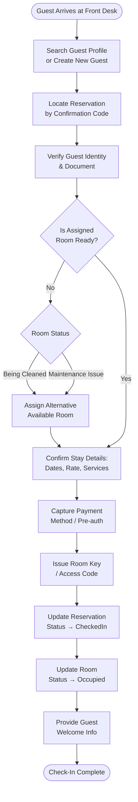
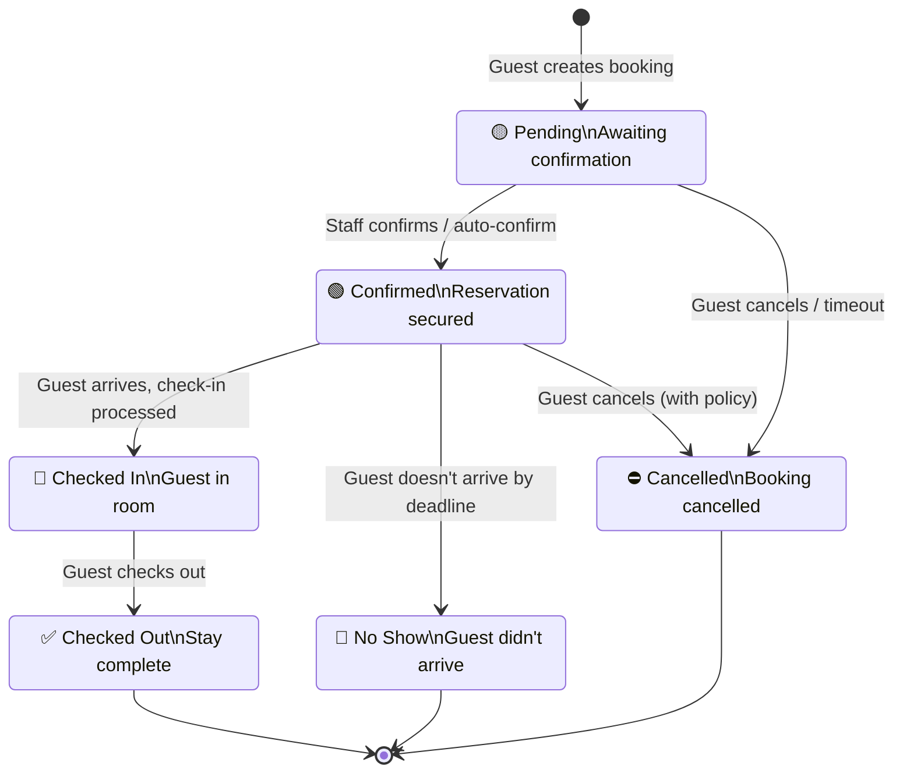
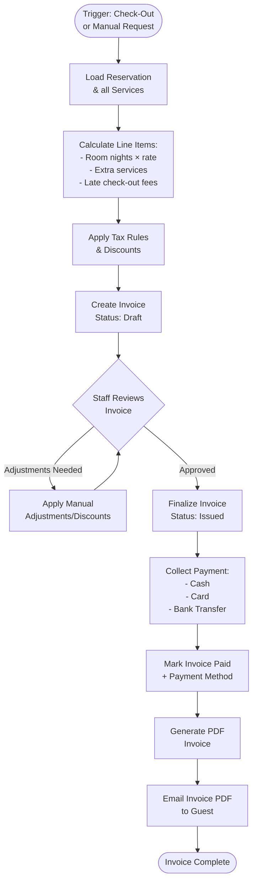
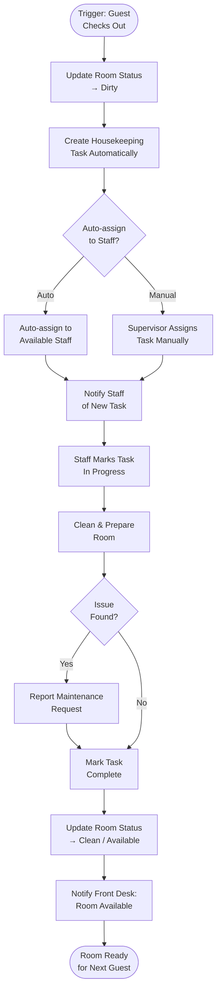

# StayFlow Cloud — Activity / Process Diagrams

## 1. Guest Check-In Process



---

## 2. Reservation Lifecycle



---

## 3. Invoice Generation & Payment



---

## 4. Housekeeping Workflow



---

## 5. CI/CD Deployment Pipeline

```mermaid
flowchart LR
    Dev[Developer\nPushes Code]
    GH[GitHub\nRepository]

    subgraph "GitHub Actions"
        Lint[Lint &\nFormat Check]
        Build[Build &\nCompile]
        Test[Run Tests]
        DockerBuild[Docker Build\n(API + Web)]
        Push[Push to\nAzure ACR]
        Deploy[Deploy to\nAzure Container Apps]
    end

    Neon["DB Migrations\n(Migration Host)"]
    Live[Live Production\nEnvironment]

    Dev -->|git push| GH
    GH --> Lint
    Lint -->|pass| Build
    Build -->|pass| Test
    Test -->|pass| DockerBuild
    DockerBuild -->|images| Push
    Push --> Deploy
    Deploy --> Neon
    Deploy --> Live

    Lint -->|fail| Dev
    Build -->|fail| Dev
    Test -->|fail| Dev
```
