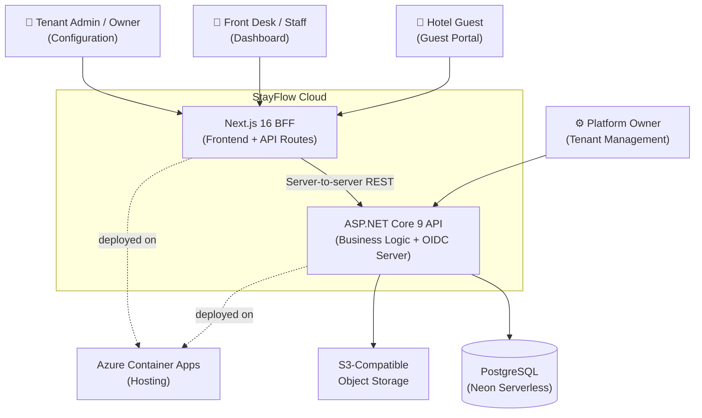
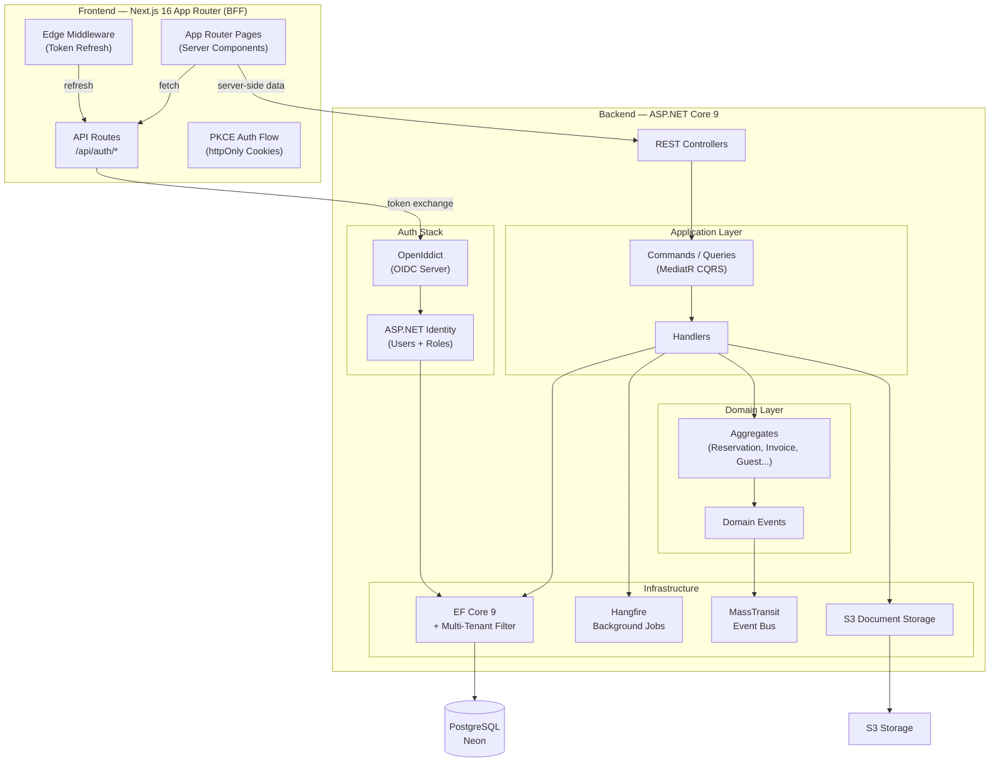
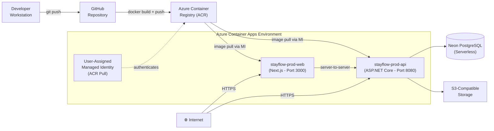

# StayFlow Cloud — Architecture Overview

## What Is StayFlow Cloud?

StayFlow Cloud is a **multi-tenant SaaS hospitality management platform** designed for hotels and accommodation businesses. It handles reservations, front desk operations, housekeeping, billing, guest management, analytics, and document storage — all isolated per hotel tenant.

---

## High-Level System Context

---

## Component Architecture

---

## Deployment Architecture

---

## Multi-Tenancy Model

- Every business entity carries a `TenantId` (GUID).
- `ITenantProvider` extracts the current tenant from the authenticated user's JWT claims.
- EF Core global query filters automatically scope all queries — no manual `WHERE TenantId = X` needed.
- Tenant isolation is enforced at the database **row level**.
- Platform-level operations bypass tenant filtering via admin authorization policies.

---

## Domain Modules

| Module | Responsibility |
|--------|---------------|
| **Reservations** | Booking lifecycle, room assignment, check-in/check-out |
| **Rooms & Room Types** | Room configuration, status, maintenance |
| **Guests** | Guest profiles, history, loyalty data |
| **Billing / Invoices** | Invoice generation, line items, payments |
| **Housekeeping** | Cleaning tasks, room status transitions |
| **Maintenance** | Issue tracking for rooms |
| **Orders & Services** | In-stay services (room service, amenities) |
| **Staff** | Hotel staff management, roles and permissions |
| **Analytics & Reports** | Occupancy, revenue dashboards, export |
| **Documents** | File upload/download per entity |
| **Tenants** | Tenant provisioning and feature flags |

---

## Technology Stack

| Layer | Technology | Version |
|-------|-----------|---------|
| Frontend | Next.js (App Router, Turbopack) | 16.x |
| Frontend Language | TypeScript | 5.x |
| Frontend Styles | Tailwind CSS + shadcn/ui | — |
| Backend Framework | ASP.NET Core | 9.0 |
| Backend Language | C# | 13 |
| Authentication | OpenIddict (OIDC) + ASP.NET Identity | 5.x |
| CQRS / Mediator | MediatR | — |
| ORM | Entity Framework Core | 9.x |
| Background Jobs | Hangfire | — |
| Event Bus | MassTransit (loopback) | — |
| Database | PostgreSQL via Neon (serverless) | 17 |
| Object Storage | S3-Compatible | — |
| Container Platform | Azure Container Apps | — |
| Image Registry | Azure Container Registry | — |
| IaC | Azure Bicep | — |
| CI/CD | GitHub Actions | — |
