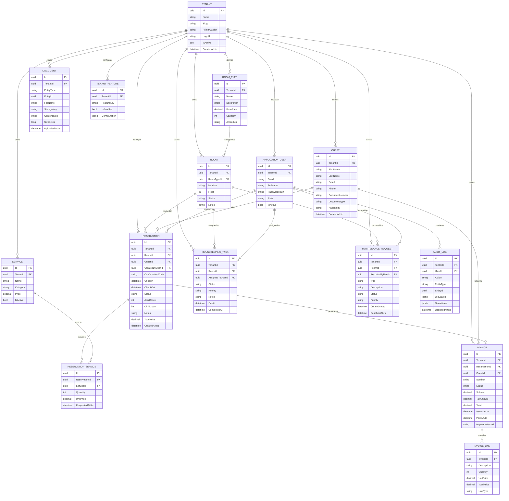
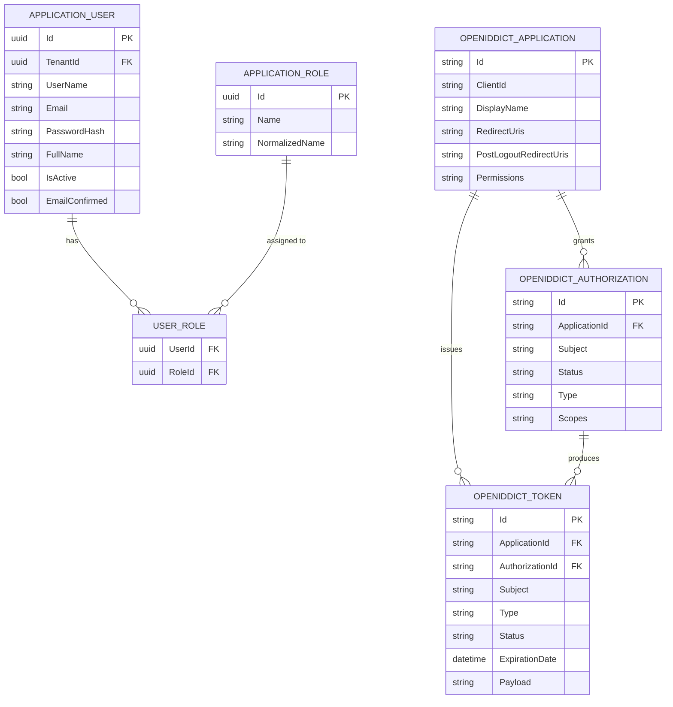

# StayFlow Cloud — Entity-Relationship Diagram

## Core Domain Entities

```mermaid
erDiagram
    TENANT {
        uuid Id PK
        string Name
        string Slug
        string PrimaryColor
        string LogoUrl
        bool IsActive
        datetime CreatedAtUtc
    }

    APPLICATION_USER {
        uuid Id PK
        uuid TenantId FK
        string Email
        string FullName
        string PasswordHash
        string Role
        bool IsActive
    }

    ROOM_TYPE {
        uuid Id PK
        uuid TenantId FK
        string Name
        string Description
        decimal BaseRate
        int Capacity
        string Amenities
    }

    ROOM {
        uuid Id PK
        uuid TenantId FK
        uuid RoomTypeId FK
        string Number
        int Floor
        string Status
        string Notes
    }

    GUEST {
        uuid Id PK
        uuid TenantId FK
        string FirstName
        string LastName
        string Email
        string Phone
        string DocumentNumber
        string DocumentType
        string Nationality
        datetime CreatedAtUtc
    }

    RESERVATION {
        uuid Id PK
        uuid TenantId FK
        uuid RoomId FK
        uuid GuestId FK
        uuid CreatedByUserId FK
        string ConfirmationCode
        datetime CheckIn
        datetime CheckOut
        string Status
        int AdultCount
        int ChildCount
        string Notes
        decimal TotalPrice
        datetime CreatedAtUtc
    }

    RESERVATION_SERVICE {
        uuid Id PK
        uuid ReservationId FK
        uuid ServiceId FK
        int Quantity
        decimal UnitPrice
        datetime RequestedAtUtc
    }

    SERVICE {
        uuid Id PK
        uuid TenantId FK
        string Name
        string Category
        decimal Price
        bool IsActive
    }

    INVOICE {
        uuid Id PK
        uuid TenantId FK
        uuid ReservationId FK
        uuid GuestId FK
        string Number
        string Status
        decimal Subtotal
        decimal TaxAmount
        decimal Total
        datetime IssuedAtUtc
        datetime PaidAtUtc
        string PaymentMethod
    }

    INVOICE_LINE {
        uuid Id PK
        uuid InvoiceId FK
        string Description
        int Quantity
        decimal UnitPrice
        decimal TotalPrice
        string LineType
    }

    HOUSEKEEPING_TASK {
        uuid Id PK
        uuid TenantId FK
        uuid RoomId FK
        uuid AssignedToUserId FK
        string Status
        string Priority
        string Notes
        datetime DueAt
        datetime CompletedAt
    }

    MAINTENANCE_REQUEST {
        uuid Id PK
        uuid TenantId FK
        uuid RoomId FK
        uuid ReportedByUserId FK
        string Title
        string Description
        string Status
        string Priority
        datetime CreatedAtUtc
        datetime ResolvedAtUtc
    }

    DOCUMENT {
        uuid Id PK
        uuid TenantId FK
        string EntityType
        uuid EntityId
        string FileName
        string StorageKey
        string ContentType
        long SizeBytes
        datetime UploadedAtUtc
    }

    AUDIT_LOG {
        uuid Id PK
        uuid TenantId FK
        uuid UserId FK
        string Action
        string EntityType
        uuid EntityId
        jsonb OldValues
        jsonb NewValues
        datetime OccurredAtUtc
    }

    TENANT_FEATURE {
        uuid Id PK
        uuid TenantId FK
        string FeatureKey
        bool IsEnabled
        jsonb Configuration
    }

    TENANT ||--o{ APPLICATION_USER : "has staff"
    TENANT ||--o{ ROOM_TYPE : "defines"
    TENANT ||--o{ ROOM : "owns"
    TENANT ||--o{ GUEST : "serves"
    TENANT ||--o{ RESERVATION : "manages"
    TENANT ||--o{ SERVICE : "offers"
    TENANT ||--o{ INVOICE : "issues"
    TENANT ||--o{ HOUSEKEEPING_TASK : "tracks"
    TENANT ||--o{ MAINTENANCE_REQUEST : "tracks"
    TENANT ||--o{ DOCUMENT : "stores"
    TENANT ||--o{ TENANT_FEATURE : "configures"

    ROOM_TYPE ||--o{ ROOM : "categorizes"
    ROOM ||--o{ RESERVATION : "booked in"
    ROOM ||--o{ HOUSEKEEPING_TASK : "assigned to"
    ROOM ||--o{ MAINTENANCE_REQUEST : "reported for"

    GUEST ||--o{ RESERVATION : "makes"
    GUEST ||--o{ INVOICE : "billed to"

    RESERVATION ||--o{ RESERVATION_SERVICE : "includes"
    RESERVATION ||--o| INVOICE : "generates"
    SERVICE ||--o{ RESERVATION_SERVICE : "used in"

    INVOICE ||--o{ INVOICE_LINE : "contains"

    APPLICATION_USER ||--o{ RESERVATION : "created by"
    APPLICATION_USER ||--o{ HOUSEKEEPING_TASK : "assigned to"
    APPLICATION_USER ||--o{ MAINTENANCE_REQUEST : "reported by"
    APPLICATION_USER ||--o{ AUDIT_LOG : "performs"
```

---

## Identity & Auth Entities

```mermaid
erDiagram
    APPLICATION_USER {
        uuid Id PK
        uuid TenantId FK
        string UserName
        string Email
        string PasswordHash
        string FullName
        bool IsActive
        bool EmailConfirmed
    }

    APPLICATION_ROLE {
        uuid Id PK
        string Name
        string NormalizedName
    }

    USER_ROLE {
        uuid UserId FK
        uuid RoleId FK
    }

    OPENIDDICT_APPLICATION {
        string Id PK
        string ClientId
        string DisplayName
        string RedirectUris
        string PostLogoutRedirectUris
        string Permissions
    }

    OPENIDDICT_TOKEN {
        string Id PK
        string ApplicationId FK
        string AuthorizationId FK
        string Subject
        string Type
        string Status
        datetime ExpirationDate
        string Payload
    }

    OPENIDDICT_AUTHORIZATION {
        string Id PK
        string ApplicationId FK
        string Subject
        string Status
        string Type
        string Scopes
    }

    APPLICATION_USER ||--o{ USER_ROLE : "has"
    APPLICATION_ROLE ||--o{ USER_ROLE : "assigned to"
    OPENIDDICT_APPLICATION ||--o{ OPENIDDICT_TOKEN : "issues"
    OPENIDDICT_APPLICATION ||--o{ OPENIDDICT_AUTHORIZATION : "grants"
    OPENIDDICT_AUTHORIZATION ||--o{ OPENIDDICT_TOKEN : "produces"
```
