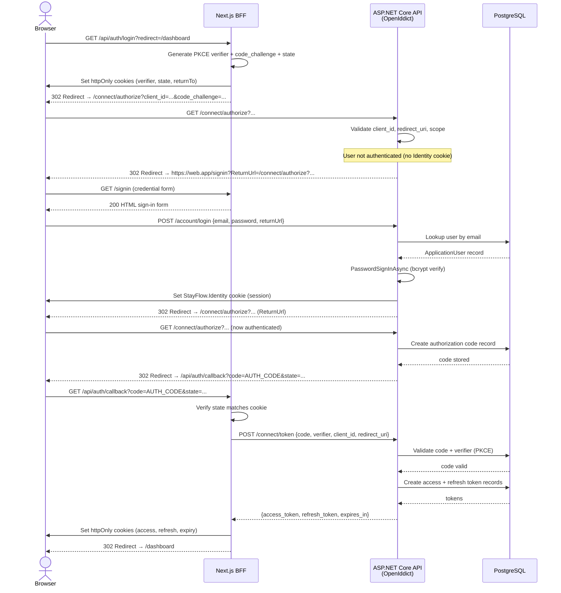
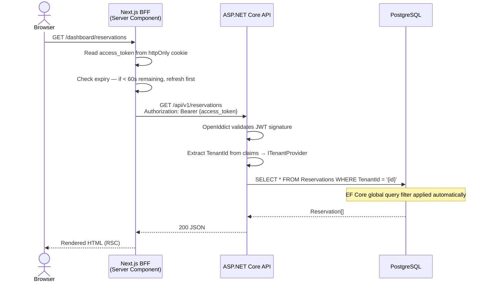
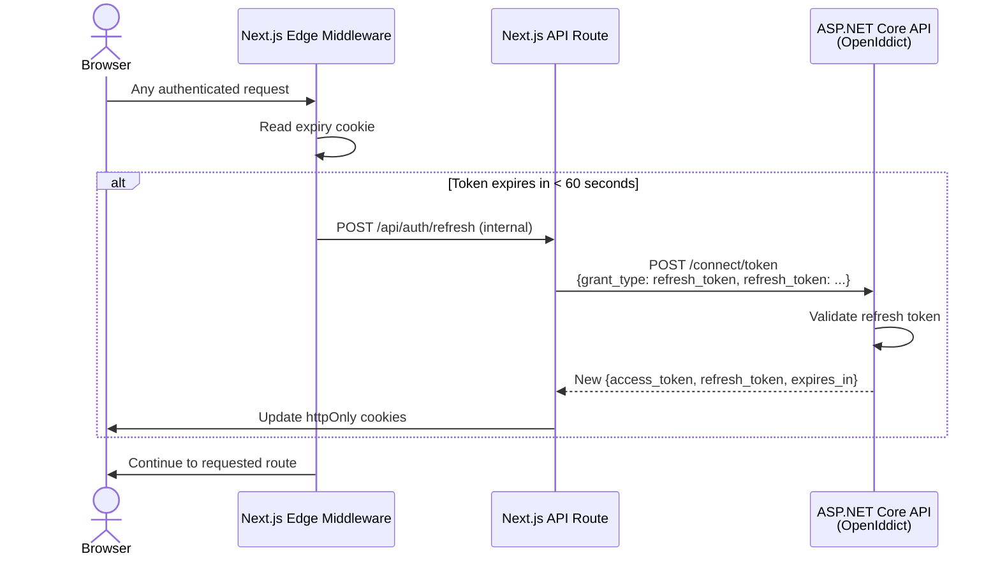
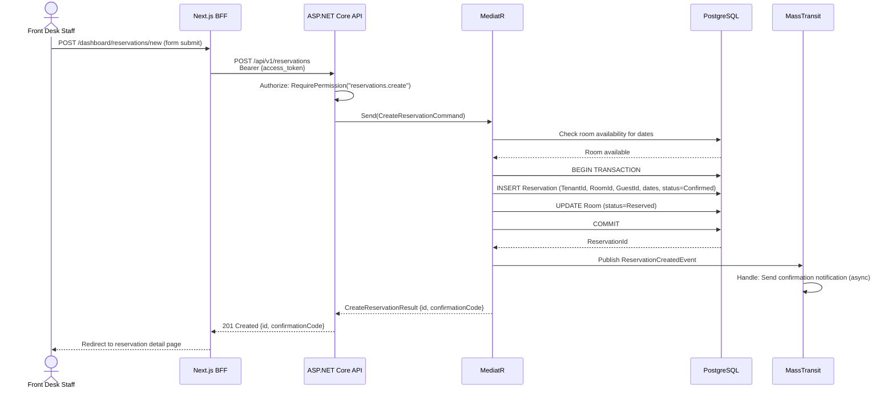
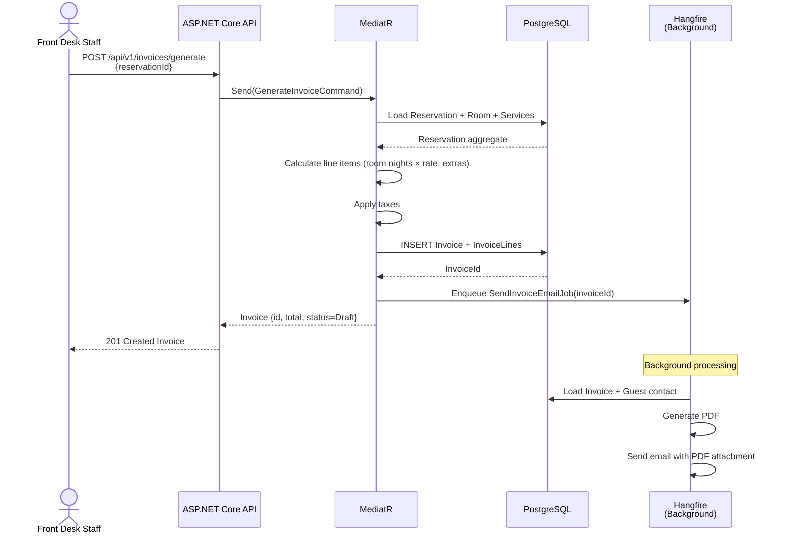
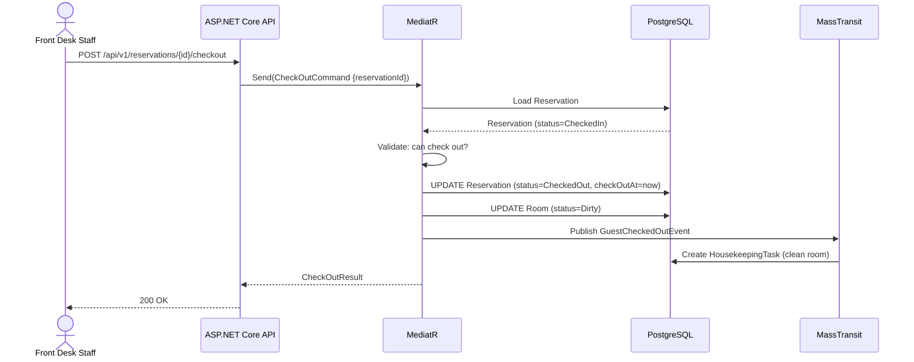

# StayFlow Cloud — Sequence Diagrams

## 1. Authentication Flow (OIDC Authorization Code + PKCE)

---

## 2. Authenticated API Request (Server-to-Server)

---

## 3. Token Refresh Flow (Edge Middleware)

---

## 4. Reservation Creation Flow

---

## 5. Invoice Generation Flow

---

## 6. Check-Out Flow

