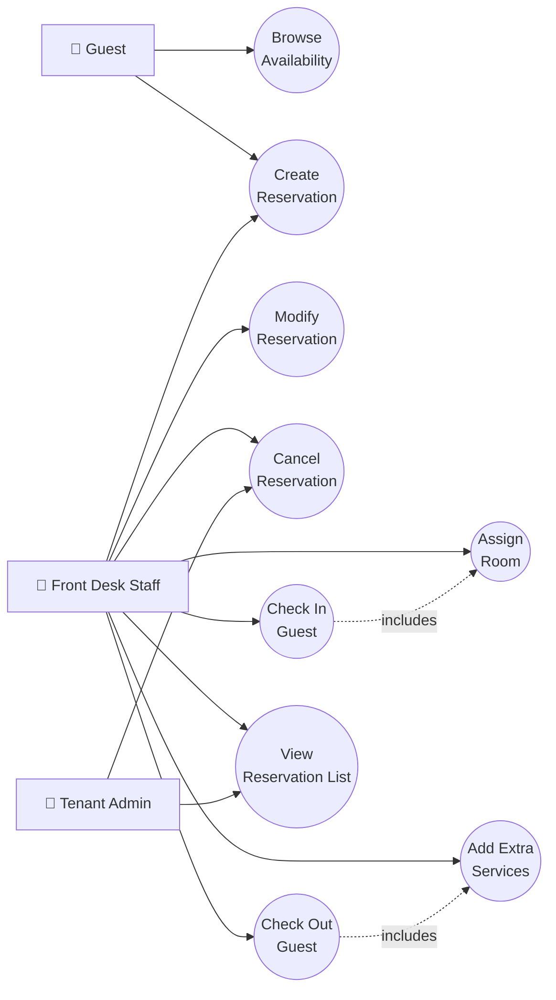
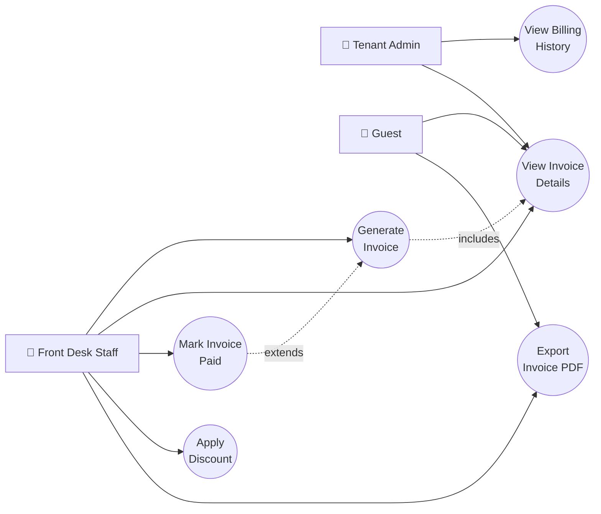
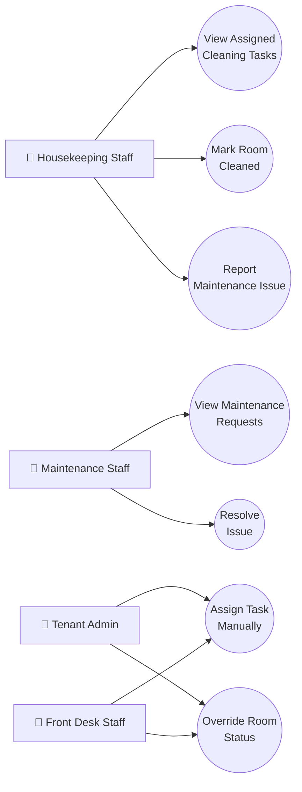
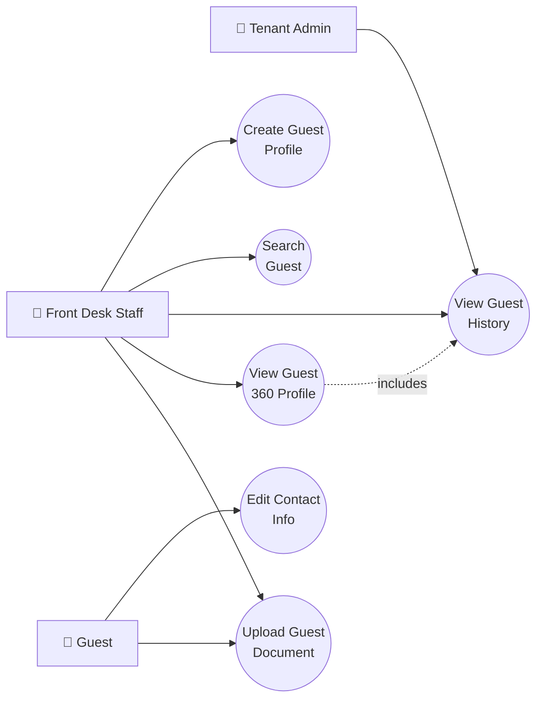
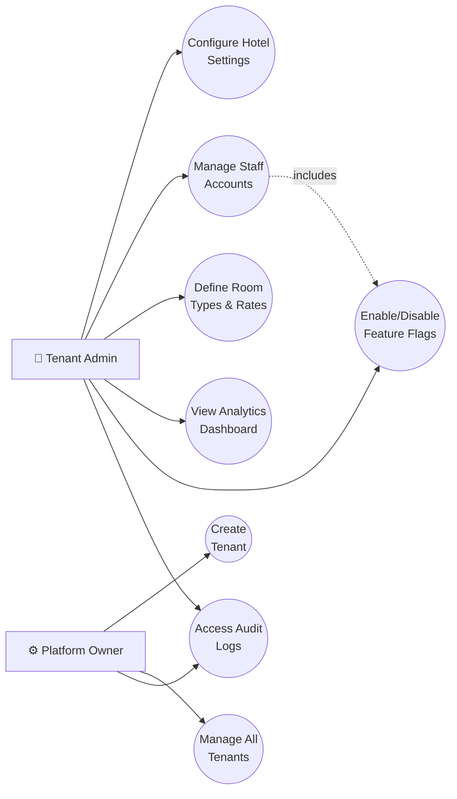
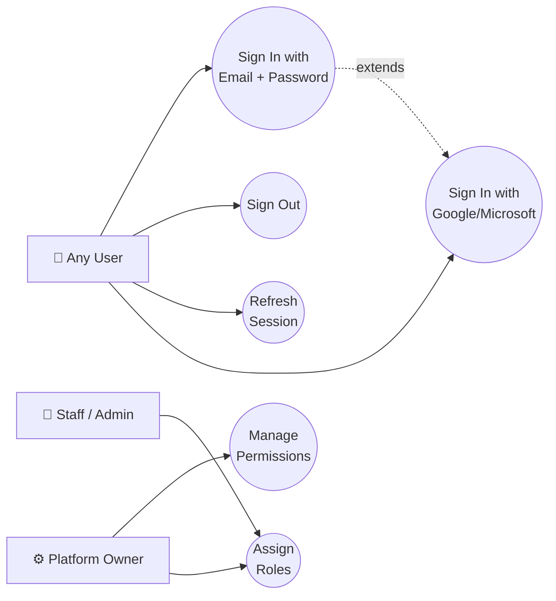

# StayFlow Cloud — Use Case Diagrams

## System Actors

| Actor | Description |
|-------|-------------|
| **Guest** | Hotel guest with access to the self-service guest portal |
| **Front Desk Staff** | Hotel staff managing day-to-day operations |
| **Housekeeping Staff** | Staff managing room cleaning tasks |
| **Tenant Admin** | Hotel owner/manager configuring the system |
| **Platform Owner** | StayFlow Cloud operator managing all tenants |

---

## 1. Reservation Management

---

## 2. Billing & Invoicing

---

## 3. Housekeeping & Maintenance

---

## 4. Guest Management

---

## 5. Tenant Administration

---

## 6. Authentication & Access Control

